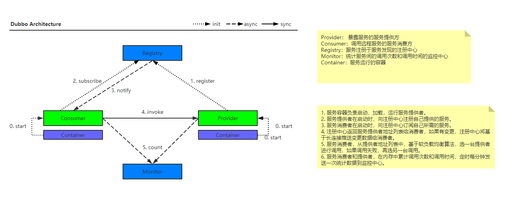
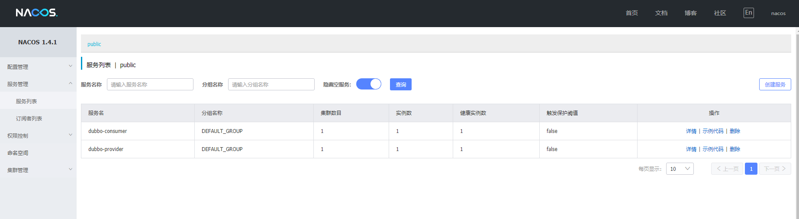
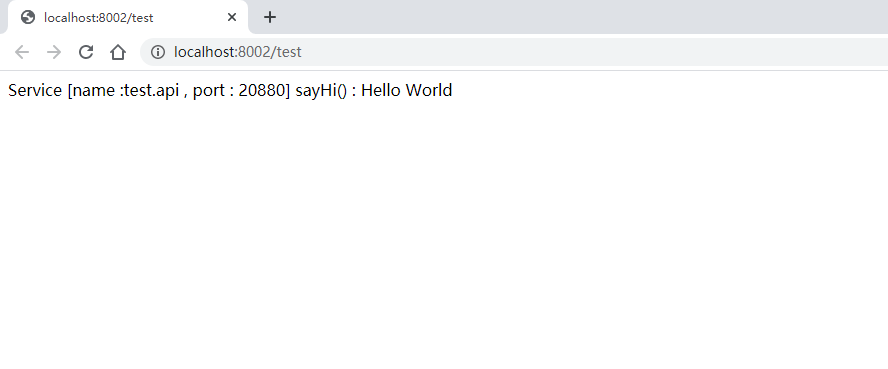

# Dubbo Provider-Consumer Example

该项目以`生产者-消费者`的示例，介绍`dubbo`搭配`nacos`实现微服务下不用服务间进行`RPC调用`的过程。下面对二者做简答的使用方式介绍。

## 开发环境

- `java 1.8`
- `springboot 2.3.7.RELEASE`
- `spring cloud 2.2.2.RELEASE`
- `nacos server 1.4.1`

## Nacos

`Nacos`为一款提供动态服务发现、配置管理和服务管理等功能平台，本示例项目中使用它作为`registry`的角色。

### 搭建步骤

1. 在https://github.com/alibaba/nacos/releases 中选择稳定版本下载，示例中的版本为`1.4.1`
2. 解压后已单节点模式运行`./bin/startup.sh -m standalone`
3. 登陆http://localhost:8848 查看，用户名与密码为`nacos/nacos`

## Dubbo

`Dubbo`为一款高性能、轻量级的开源java服务框架，这里使用其面向接口代理的`RPC`调用功能。 

### 架构

`Dubbo`的基础架构如下图所示。



### 依赖

在使用`Dubbo`时，需加入依赖

```xml

<dependency>
    <groupId>com.alibaba.cloud</groupId>
    <artifactId>spring-cloud-starter-alibaba-nacos-discovery</artifactId>
</dependency>
<dependency>
	<groupId>com.alibaba.cloud</groupId>
	<artifactId>spring-cloud-starter-dubbo</artifactId>
</dependency>
```

与依赖管理

```xml
<dependencyManagement>
    <dependencies>
        <dependency>
            <groupId>org.springframework.boot</groupId>
            <artifactId>spring-boot-dependencies</artifactId>
            <version>${spring-boot.version}</version>
            <type>pom</type>
            <scope>import</scope>
        </dependency>
        <dependency>
            <groupId>com.alibaba.cloud</groupId>
            <artifactId>spring-cloud-alibaba-dependencies</artifactId>
            <version>${spring-cloud-alibaba.version}</version>
            <type>pom</type>
            <scope>import</scope>
        </dependency>
    </dependencies>
</dependencyManagement>
```

### 配置

在配置文件`application.properties`中声明

```properties
spring.application.name=my-app
server.port=8080
# Dubbo
dubbo.protocol.id=dubbo
dubbo.protocol.name=dubbo
dubbo.protocol.port=-1
# Dubbo 消费端订阅服务端的应用名，多个服务提供者用逗号分隔
# 这里订阅"自己"，会被忽略掉，请根据实际情况添加
dubbo.cloud.subscribed-services=my-app
dubbo.scan.base-packages=com.rainlf.dubbo.example
# Nacos
spring.cloud.nacos.discovery.server-addr=localhost:8848
spring.cloud.nacos.discovery.namespace=public
spring.cloud.nacos.discovery.username=nacos
spring.cloud.nacos.discovery.password=nacos
```

### 应用

服务提供者使用`@DubboService`注解声明服务，如：

```java

@Slf4j
@DubboService(interfaceName = "test.api")
public class TestApiImpl implements TestApi {
    @Override
    public String sayHi() {
        RpcContext rpcContext = RpcContext.getContext();
        String result = String.format("Service [name :test.api , port : %d] %s() : Hello World",
                rpcContext.getLocalPort(),
                rpcContext.getMethodName());
        log.info(result);
        return result;
    }
}
```

服务消费者使用`@DubboReference`注解注入服务，如：

```java
@DubboReference(interfaceName = "test.api")
private TestApi testApi;

@GetMapping("/test")
public String test(){
        return testApi.sayHi();
        }
```

启动服务后可以在`nacos`注册中心看到服务上线



访问http://localhost:8002/test 可以看到RPC调用生效



